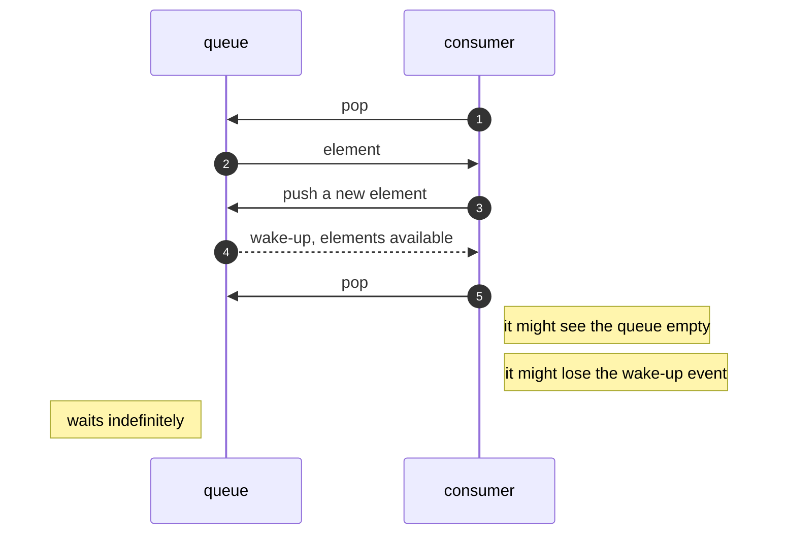

This is a series of articles describing the technical details on which `keuss` is based to build a rather complete
queue middleware (`QMW` henceforth) with a quite shallow layer on top of `MongoDB`. The basic approach is well known and understood, but
`keuss` goes well beyond the basic approach to provide extra functionalities

## Some nomenclature

Let us start establishing some common nomenclature that will appear later on:

* ***job queue***: A construct where elements can be inserted and extracted, in a FIFO (first in, first out) manner. Elements 
  extracted are removed from the queue and are no longer available
* ***queue middleware (qmw)***: A system that provides queues and means for actors to perform as producers, consumers or both
* ***push***: action of inserting an element into a queue
* ***pop***: action of extracting an element from a queue
* ***reserve/commit/rollback***: operations to provide more control on the extraction of elements: first the element is _reserved_,
  (making it invisible by other _reserve_ or _pop_ operations, but still present in the queue), then once the element is processed it is _committed_ (and only then the element is removed from the queue) or _rolledback_ (meaning it is made eligible again for other `reserve` or `pop`, possibly after some delay); if neither `commit` or `rollback` happen after some time, an automatic `rollback` is applied
* ***consumer***: an actor performing `pop` and/or `reserve-commit-rollback` operations on a queue. A queue can have zero or more concurrent consumers
* ***producer***: an actor performing `push` operations on a queue. A queue can have zero or more concurrent producers
* ***at-most-once***: consumer guarantee associated with the `pop` operation: since the element is first removed from the queue, and
  then the consumer proceeds to process it, if the consumer dies or crashes in between, the element will be lost. That is, losses are
  tolerated, but duplications are not

  ```mermaid
  sequenceDiagram
    autonumber
    participant queue
    participant consumer
    consumer->>+queue: pop
    queue->>-consumer: element
    activate consumer
    note left of queue: element is no longer in queue
    note right of consumer: process element
    deactivate consumer
    note right of consumer: element processed, get another
    consumer->>+queue: pop
    queue->>-consumer: element
    
  ```

* ***at-least-once***: consumer guarantee associated with the `reserve-commit-rollback` operations: if the consumer crashes between
  `reserve` and `commit` the element will eventually be auto-rolledback and be processed again (possibly by another consumer). 
  Therefore, duplications are tolerated but losses are not

  ```mermaid
  sequenceDiagram
    autonumber
    participant queue
    participant consumer
    consumer->>+queue: reserve
    queue->>-consumer: element
    activate consumer
    note left of queue: element is still in queue, but not accesible to other consumers
    note right of consumer: process element
    consumer->>-queue: commit
    activate queue
    queue->>consumer: ack
    deactivate queue
    note left of queue: element is no longer in queue
    note right of consumer: element processed, get another
    consumer->>+queue: pop
    queue->>-consumer: element
  ```

* ***exactly-once***: theoretical consumer guarantee where no losses and no duplications can happen. It involves the use of monotonical 
  identifiers or window-based duplication detection, and is generally extremely complex to achieve, and almost in all cases with a
  hefty performance penalty. It is almost never offered out of the box in any QMW
* ***deadletter queue***: usually, there is a maximum number of times an element can be rolled back after a reserve, in order to prevent ill-formed or otherwise incorrect messages to stay forever in queues. Upon rollback, if the element has reached the maximum number of rollbacks it is removed from the queue and pushed into the deadletter queue, which is an otherwise regular queue
* ***ordered queue***:  A non-FIFO queue: insertions are not done at the tail of the queue, but at any point. This means insertions are
  no longer _O(1)_: depending on the technology used they can be _O(n)_ or better, such as _O(log(n))_ for a btree-based queue; same goes for push/reserve operations, they are no longer _O(1)_

  Using ordered queues on a QMW is key to implement certain operations: not only the more obvious such as delay, schedule or priorities,
  but also robust and performing reserve/commit/rollback
  
  Using a database to implement queues makes ordered queues a bliss: using a regular index is usually all you need to get
  near-constant-complexity operations
* ***delay/schedule***: Push operation when the element is marked not to be eligible for `pop` or `reserve` _before_ a certain time. 
  The presence of delayed elements must not impact in any way the rest of elements (that is, the rest of elements' eligibility must not
  change) or the queue itself (that is, the presence of delayed elements must not degrade the queue performance or capabilities)

  This feature can be very easily implemented using an ordered queue, where the order is defined by a timestamp representing the 
  _mature_ time: the time when the element can be popped or reserved, and not before

  The delay/schedule feature can be applied also to rollbacks, since a `rollback` is conceptually a re-insertion; delays in rollbacks
  provide a way to implement [exponential backoff](https://en.wikipedia.org/wiki/Exponential_backoff) easily, to prevent busy   reserve-fail-rollback loops, when one element in the queue is repeatedly rolled back upon processing

## Basic building blocks

Here's what you need to build a proper QMW:

1. A ***storage subsystem***: Data for the contents of the queues have to be stored somewhere. It has to provide:
    1. **Persistency**: data must be stored in a permanent manner, reliably. In-memory QMW has its niche, but we will
       focus on _persistent_ QMWs
    2. **High Availability**: we do not want a hardware or network failure to take down the QMW. It should run in a _cluster_
       manner, on several machines (possibly in separated geographical locations); if one of the machines fail the rest
    can cope without (or with minimal) disruption
    3. **Sufficient Throughput**: the storage should be able to handle a high number of operations per second
    4. **Low Latency**: operations should be performed very fast, ideally as independent of throughput as possible

2. An ***event bus***: all QMW clients would need some form of central communication to be aware of certain events in the
   QWM. For example, if a client is waiting for data to become available in a queue, it should be able to simply await for
   an event, instead of running a poll busy-loop. Another example  of useful event is to signal whether a queue becomes
   paused (since it must be paused for _all_ clients)

   This event bus can be a _pub/sub_, stateless bus: only connected clients are made aware of events and there is no need to save events for clients that may connect later. This simplifies the event bus by a lot

The whole idea behind `keuss` is that all those building blocks are already available out there in the form of DataBase
systems, and all there is to add is a thin layer and a few extras.

## The need for atomic operations

However, not just *any* storage (or DB, for that matter) is a good candidate to model queues: there is at least one feature
that, lest it be present, renders queue modelling very difficult if not impossible: _atomic modify operations_

An atomic modify operation in the context of a storage system can be defined as the ability to perform a read and a modify 
on a single record without the possibility of a second modify interfering, changing the record after the read but before 
the modify (or after the modify and before the read)

If the storage system provides such primitives, it is relatively easy and simple to model queues on top of it; also, the 
overall performance (throughput and latency) will greatly depend on the performance of such operation: most RDBMs can do
this by packing the read and the modify inside a _transaction_, but that usually degrades the performance greatly, to a
point where it is not viable for queue modelling

There are 2 major storage systems that provide all the needed blocks, along with atomic modifies: `MongoDB` and `Redis`.
`MongoDB` has turned out to be an almost perfect fit to back a QMW, as we shall see. `MongoDB` provides a set of atomic 
operations to read and modify, and to read and remove. Those operations guarantee that the elements selected to be read 
and then modified (or removed) will not be read by others until modified (or not read at all if it's removed)

`Redis` is also a good fit, but it does nor provide a good enough storage layer: it is neither persistent nor high available. 
Arguably, that's a default behaviour: `Redis-Cluster` coupled with proper persistence should in theory be up to the task. 
However, this series of articles would focus on `MongoDB` only. For now, let us say that atomic operations are very easily
added to `Redis` by coding them as `lua` extensions, since all operations in `Redis` are atomic by design

In the following sections we will see how the implementations of common QMW operations can be indeed solved elegantly using
atomic operations provided by MongoDB as the underlying DB/storage

## Simple approach: good enough queues

There is a very simple, very common way to model queues on top of mongoDB collections. This model does not support 
reserve-commit-rollback, nor it does support delay/schedule. The model can be succinctly put as:

| operation | implementation base       |
|:---------:|:-------------------------:|
| push      | `coll.insertOne (item)`   |
| pop       | `coll.findOneAndDelete()` |

The key is the use of the atomic operation `findOneAndDelete`, which is the combination of a `findOne` and a `remove`, but 
run in one single step. Several actors can perform concurrent `findOneAndDelete` operations without issues, and without 
interfering each other

Actors can perform concurrent `insertOne` operations too, without interference; the same goes for actors performing _both_
`findOneAndDelete` and `insertOne` operations. The net result is that many consumers and producers can be served concurrently
without interferences or loss of performance, which is what one expects of any self-respecting QMW

This model provides a very simple but rather capable powerful QMW:

* queues are _mostly_ strict FIFO (FIFO loses its strict meaning when different producers located in different machines
  are inserting in the same queue, but in practical terms it usually does not matter)
* we got very good persistence, as good as mongodb's
* we got very good HA:
  * both consumers and producers have no state, so they can be replicated without problems
  * there is a practical 1:1 equivalence between queues and collections, so all the HA guarantees mongodb provides on 
    collections apply directly to queues
* we got more than decent performance:
  * mongodb is quite performing on insertions, in the range of Khz (ie, thousands per second)
  * on pop operations, `findOneAndDelete` is less performing than a simple `remove` or a `findOne` but is still able to 
    reach Khz performance. In practice, `findOneAndDelete` is the bottleneck of this model, because it serializes calls 
    to `pop` within each queue

The main drawback of this model is the fact that the pop/reserve operations can only be performed in a poll loop: they 
either return an element or return 'no elements in queue' (or return an error), in all cases pretty much immediately. 
Therefore, wait state of arbitrary duration must be inserted in the consumer loop if the operation returns 'no elements in queue': 
otherwise you will get a busy loop where your pop/reserve call relentlessly return 'no elements', eating the CPU in the
process (incidentally, this is a text-book case of poll loop)

In some cases, where latencies in the range of seconds or tens of seconds are of no concern, a pool loop can be happily
used, so this makes a valid, simple and effective model, especially if you already use MongoDB. In cases where latencies
are expected to be near-realtime something better is needed

## Adding an event bus

At this point, one of the best improvements to the model is to remove the need for poll loops; for that to happen, we 
need the pop/reserve operations to 'block' if there are no elements, until they are. A naïve way to do so is to add the
poll loop in the pop/reserve calls, so the caller would have the _illusion_ of blocking:

  ```mermaid
  sequenceDiagram
    autonumber
    participant queue
    participant consumer
    participant caller
    caller->>consumer: pop
    consumer->>queue: pop
    queue->>consumer: no elements
    note right of consumer: wait a fixed period, then try again
    consumer->>queue: pop
    queue->>consumer: no elements
    note right of consumer: wait a fixed period, then try again
    note left of queue: someone else inserts at least one element
    consumer->>queue: pop
    queue->>consumer: element
    consumer->> caller: element
  ```  

As mentioned, this simply moves the pool loop inside the pop/reserve implementation, away from the user's eyes. But it
is still a poll loop, with all its limitations. To truly remove the poll loop we need the ability to _wake up_ a waiting
consumer _when_ there are new elements in the queue:

  ```mermaid
  sequenceDiagram
    autonumber
    participant producer
    participant queue
    participant consumer
    participant caller
    caller->>consumer: pop
    consumer->>queue: pop
    queue->>consumer: no elements
    note right of consumer: wait until woken up
    producer->>queue: push
    note right of queue: now we got elements
    queue-->>consumer: wake-up, elements available 
    consumer->>queue: pop
    queue->>consumer: element
    consumer->> caller: element
  ``` 
 
This way the push-to-pop latencies are reduced to close to the theoretical minimum: any consumer would be blocked only when
they have to: when there are no elements

### Possible implementations
There is an obvious option for the implementation of such an event bus: a pub/sub subsystem. Pub/sub is very well understood, 
it's stateless and there are a lot of stable implementations. And more importantly, there are stable implementations _on top_
of we already use for storage of queues.

The main disadvantages of pub/sub in themselves as event bus are:
* they can not handle duplicates: in an HA setup all the replicas of a given client will get a separated copy of each event
* they have no history: disconnected clients will miss any event published when they're not connected

But none of those is a real disadvantage for us:
* each client, whether a replica or not, _must_ receive a copy of each event
* disconnected clients do not need to receive and react to events, since they're not dealing with queues

Let's see the most viable implementations:
#### In-memory pub/sub
This is a very simple, extremely nimble implementation of a pub/sub that works only within the same (OS) process. It's only 
meant to be used for testing. It can be also seen as the _canonical_ implementation of the event bus

A very good and very simple implementation for node.js is [mitt](https://www.npmjs.com/package/mitt)

#### Redis pub/sub
`redis` offers a simple and very efficient [pub/sub implementation](https://redis.io/docs/manual/pubsub/), which can be used 
as is. If you already use redis it's definitely the way to go

#### MongoDB capped collection (also a pub/sub)
Since `mongoDB` is used to back the queues, it would be great if it could also power the rest of the needed subsystems; and it does,
with a just a little implementation work: it is relatively easy to build a pubsub on top of 
[mongoDB capped collections](https://www.mongodb.com/docs/upcoming/core/capped-collections/), and there are quite a few 
implementations readily available. One good example of such implementation in node.js is [mubsub](https://www.npmjs.com/package/@nodebb/mubsub)

Using this implementation has the added appeal of not adding any extra dependency: you can just use the same mongoDB server used for
the queues

This implementations has the added benefit of _history state_: it operates like a ring buffer, so there is the possibility of 
accessing past events. However, this is not needed at all here

### Practical considerations & improvements
There are a few considerations worth noting about how pubsub fits our purpose, and a few extras we can add to improve matters further

#### Race conditions
A pubsub bus is asynchronous in nature, so under some conditions you may lose events. Take for example the case of a single client
that reinserts an element in the same queue it is consuming from: the event fired upon the insertion is produced at about the same time
the client attempts to pop another element. However, if the pop operation establishes the queue is empty (because the queue size was 
not yet updated after the insert) but the event arrives before the pop operation starts waiting for them, you lose the event and you 
risk waiting forever, when the queue has indeed one element



Race conditions such as this one are very hard to prevent entirely, if at all possible. For that reason it is recommended to use
a model in which race conditions do not cause major issues

In a system such as a `QMW` the problems to avoid at all costs are:
* loss of messages
* duplication of messages
* deadlocks and other forms of wait-forever conditions

Race conditions on wake-up events won't cause loss or duplication of messages, since this is guaranteed by the queue model; they can
however cause deadlocks, where a consumer is left waiting forever for an event that may never arrive

One way to remove this problem is to add a timeout and a poll loop: in the absence of events, the consumer will fallback into a poll
loop with a rather long period (this period would be the wait-for-events timeout), usually in the range of tens of seconds. With this
we change deadlocks into poll cycles, or deadlocks into increased latency for some rare cases

The consume pop loop would look like this:
```
forever do:
  msg := pop_msg_from_queue()  // nonblocking operation, either returns a message or null if none available
  if (!msg) do:
    await wake_up(insertion) or timeout(period)
    continue // a wakeup event arrived or the the timeout was reached: next loop either way
  else
    return msg
  done
done
```

#### High cardinality of events
A side effect of having 'insert' events published is that subscribers must be ready to deal with potentially enormous amounts of events;
if you're inserting messages in queues at, say 1 Khz and you have 50 consumers, you will have 50,000 individual events to deal with. 
Besides, most of those events will add no information at all: once a consumer is woken up, it would not be interested in insert events until the queue is empty again; queue consumers just ignore events emitted when they are not idle, but the raw amount of events in the
bus might still need a noticeable amount of compute and I/O (especially on non-local pubsubs)

A simple way to minimize this is to simply ignore events if an equivalent one was emitted already in a short period of time; if that is
the case, the event is ignored right before the publish, and does not make it to the pubsub at all

Keuss uses exactly this strategy on all the included signal pubsubs, using a window of 50 ms: if the same event was emitted for the same queue within 50 ms in the past, it is ignored

##### Drawbacks
This strategy has a notable drawback: it introduces an apparent race condition.

Take a queue with a single consumer; insert a single message in the queue, which would be immediately taken by the consumer. If the 
consumer rejects the message with a zero delay, the consumer may still see zero elements in the next iteration, so it'll block and 
wait for insert events. The reject will indeed produce an insert event... which will be dropped because it's equivalent to the first
insert event, that was emitted about the same millisecond

This will just be a nuisance, since the consumer would time out and rearm itself eventually. But be warned, this can happen on edge 
cases

#### Adding another pub/sub implementation
The interface for pubsub in Keuss is very simple, so adding new or different implementations would be quite easy. For example, if
you already use `mqtt`, it makes sense to reuse it to power the event pubsub. This is however out of scope

### Final thoughts
At this point we got a rather decent QMW capable of push/pop with concurrent publishers and consumers, with persistence and HA, and 
able to manage operations at Khz frequency with millisec latencies; all this with a quite simple and stateless implementation

This model can already solve a great deal of problems where persistent job queues are needed, especially if you already got MongoDB
in your mix. Also, it has 2 advantages over traditional QMWs :

1. _Performance_: This model produces great performance figures when compared with traditional QMWs with full persistence/HA activated
2. _Simplicity_: the whole of the implementation is client side, and it is stateless and very thin.
3. _Ease of debug_: it is very easy to _open the trunk_, peek inside and see exactly what's in each queue, and it equally easy to tweak
   and fix whatever problem you find. In some situations this is an invaluable feature

However, we can [do better](/blog/2024/01/23/queues-on-mongo-part-2)...
